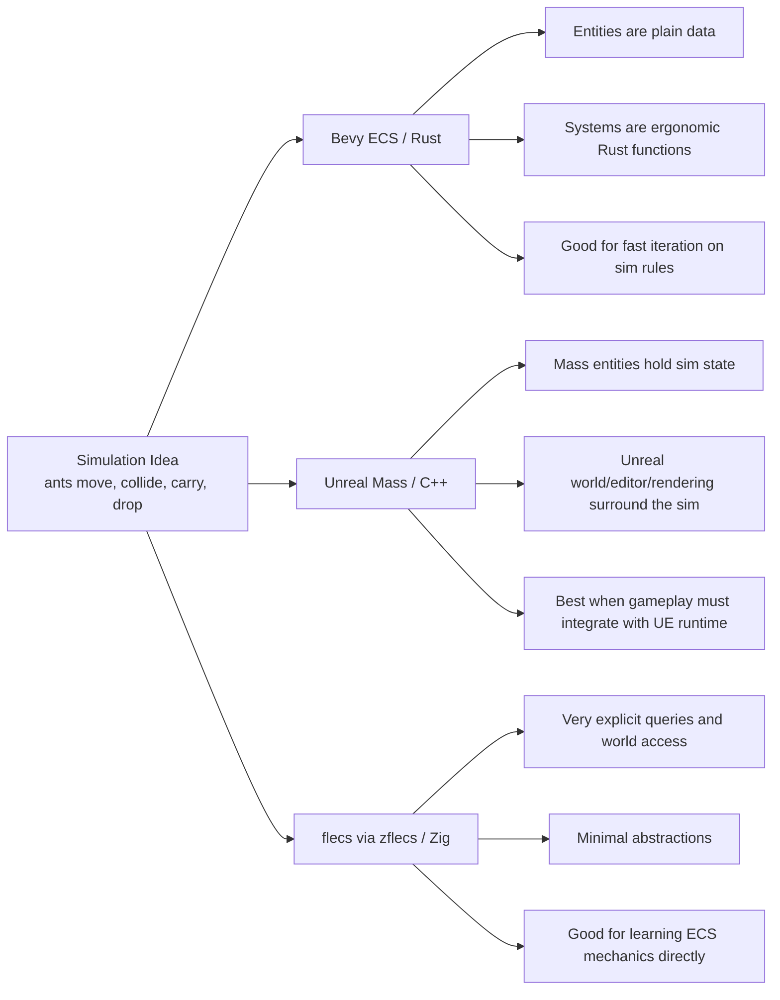

# Bevy, Unreal Mass, and Zig zflecs Comparison

## Purpose

This note compares the three ECS directions now present around this project:

- Bevy ECS in Rust
- Unreal Mass in C++
- flecs via `zflecs` in Zig

It also compares the languages involved:

- Rust
- C++
- Zig

The goal is not to declare one winner. The interesting part is how the same gatherers simulation feels when expressed through three different ECS models and three different language/tooling stacks.

## Executive Summary

At a high level:

- Bevy is the cleanest expression of the simulation as pure game logic.
- Unreal Mass is the strongest fit when the simulation must live inside a large real-time engine with editor workflows, assets, and visual integration.
- flecs via Zig is the most explicit and lightweight feeling, but it gives you the least framework help and the most responsibility for conventions, safety, and tooling choices.

At the language level:

- Rust gives the strongest safety and the clearest refactoring confidence.
- C++ gives the deepest engine access and the broadest ecosystem reach, but it has the most footguns.
- Zig gives a very direct, understandable systems-programming experience, but it currently asks more from the programmer in architecture discipline and ecosystem selection.

## The Same Simulation Through Three ECS Lenses

## ECS Model Comparison

### Bevy ECS

Bevy feels the most like "write the simulation directly."

Strengths:

- systems are ordinary Rust functions with declarative queries
- composition is simple and readable
- data ownership is usually obvious
- the code tends to stay close to the domain model
- testability is good because logic is mostly plain data plus systems

In this project, the Bevy version expresses the simulation idea very naturally:

- movement is just movement
- collisions are just collisions
- carry/drop relationships map cleanly to entities and components
- backend event emission can be another system

Weaknesses:

- Bevy is still a younger engine stack than Unreal
- editor tooling and content workflows are much lighter
- if you need rich engine subsystems, you often build more yourself

### Unreal Mass

Unreal Mass feels less like a small pure ECS library and more like an ECS subsystem inside a very large engine.

Strengths:

- strong path from simulation to real game/editor/runtime integration
- good fit for large numbers of simple entities
- can coexist with Unreal actors, maps, PIE, automation tests, and engine visuals
- great when you want ECS data plus Unreal's content pipeline and debugging environment

In this project, the Mass port ended up with a clear split:

- Mass owns simulation state and updates
- Unreal still owns the world, startup, editor workflow, assets, and visualization plumbing
- visuals can be engine-native rather than bolted on externally

That is powerful, but it is also why the code is more architectural:

- ECS fragments and subsystem lifecycle matter
- engine integration details matter
- test isolation and editor state matter
- "pure sim logic" is only part of the work

Weaknesses:

- the conceptual surface area is much larger than Bevy's
- the engine can pull you toward hybrid designs unless you are disciplined
- iteration is slower and more operationally complex
- the code often reflects engine constraints as much as the domain

### flecs via Zig

flecs in Zig feels the most explicit and low-level of the three.

Strengths:

- you can see the ECS machinery very directly
- query setup, world access, component registration, and system order are explicit
- there is very little "magic"
- it is a strong learning environment for understanding what ECS really needs at runtime

In the Zig port, this shows up as:

- explicit world creation
- explicit component registration
- explicit query descriptors
- explicit system ordering in the main loop
- explicit management of helper structures like the spatial index and hit queue

Weaknesses:

- you get fewer guardrails
- conventions are less standardized at the project level
- more design decisions stay local and manual
- it is easy to drift behaviorally from the Rust/Bevy reference unless parity is tested deliberately

## Concrete Example: Variable-Delta Simulation and Speed Modes

The Unreal port's speed control work illustrates how engine concerns shape ECS design in ways that a pure simulation framework like Bevy handles more transparently.

### The problem

The simulation needed to run faster than real time (4x, 27x, 100x) while remaining correct. In Bevy, this is mostly a matter of adjusting the fixed timestep — the framework handles the accumulator loop and the systems just see a delta time.

In Unreal Mass, the same goal required confronting several engine-level concerns:

- **Frame timing ownership**: Unreal's world tick, Mass processor execution, and the simulation clock are separate concepts that must be coordinated explicitly
- **Bounds-derived step capping**: At high speed multipliers, naive fixed-timestep accumulation produces thousands of tiny steps per frame. The solution was to derive the maximum step size from the simulation bounds (`0.5 * min(BoundsSize.X, BoundsSize.Y) / MovementSpeed`), so each step covers meaningful distance without ants tunneling through interactions
- **Accumulator loop redesign**: The tick loop runs large bounded steps first, then a remainder step, with a hard cap on steps per frame to prevent spiral-of-death stalls

### The emergent behavior bug

At 100x+ speed, food piling stopped working. Ants would pick up food and carry it across the entire step before encountering other food, so drops landed far from trigger food instead of nearby.

The root cause was an architectural issue specific to the processor pipeline:

1. The **movement processor** runs first and completes the full step
2. The **food interaction processor** runs second and sweeps retroactively from PreviousPosition to Position
3. When food was found along the sweep, the ant's Position was already at the end of the step — drops happened there, not at the encounter point

The fix was to have the food interaction processor truncate `AntFragment.Position` to the encounter point when an interaction fires. This required the sweep query to return encounter positions alongside entity handles (`FGatherersMassFoodEncounter` struct), and careful placement of the truncation so it only fires when an actual pickup or drop occurs — otherwise ants with cooldown would get stuck at food they couldn't interact with.

### What this illustrates

In Bevy, the simulation systems would naturally process movement and food interaction within the same tick at the same position. The framework's fixed-timestep model keeps steps small enough that the "move then interact" split rarely produces visible artifacts.

In Unreal Mass, the explicit processor pipeline, the separation between movement and interaction phases, and the variable-delta stepping all conspire to make this a real architectural problem that required:

- a new query API (encounter positions)
- careful conditional logic (only truncate on actual interaction)
- TDD to catch the stuck-ant regression
- understanding of how the processor execution order interacts with large time steps

This is a concrete example of the document's earlier point: Unreal Mass code "often reflects engine constraints as much as the domain." The simulation rule is simple (stop at food), but the implementation must account for processor ordering, sweep geometry, cooldown state, and variable step sizes.

## Similarities Across The Three ECS Styles

Despite the very different feel, all three share the same core wins:

- data and behavior are separated better than in classic object-heavy game code
- the simulation can be decomposed into narrow systems
- large numbers of ants/food items fit the model naturally
- carry/drop/cooldown/collision become composable state changes
- tests can target world state rather than screen pixels

That is the most important common point: the gatherers simulation is genuinely a good ECS-shaped problem in all three environments.

## The Biggest Differences In Practice

### 1. Where the "world" really lives

In Bevy, the ECS world is basically the main world.

In Unreal, Mass exists inside the broader Unreal world. Even if the sim is Mass-native, you still care about:

- game mode
- maps
- PIE
- visualization components
- automation harnesses
- editor/runtime lifecycle

In Zig with flecs, the ECS world is just the world you build. That is liberating, but it also means all surrounding structure is your job.

### 2. How relationships feel

Bevy relationship-style logic reads quite naturally in Rust.

Unreal Mass wants you to think in fragments, handles, subsystem-owned state, and sometimes explicit sync between simulation and presentation.

flecs is very capable, but via Zig bindings it feels more manual and more C-like in setup and data access.

### 3. Scheduling clarity

Bevy gives a pleasant high-level systems model, but exact ordering must still be made explicit when correctness depends on it.

Unreal makes phase/lifecycle questions more visible because engine phases, PIE state, and world initialization are impossible to ignore.

Zig + flecs makes order completely explicit in the main loop, which is simple and honest, but easy to get subtly wrong relative to a reference implementation.

### 4. Testing ergonomics

Bevy is usually easiest for unit-like simulation tests.

Unreal is heavier, but its automation framework becomes very powerful once set up because you can test:

- pure simulation helpers
- world state
- startup behavior
- visual/manual fixtures
- editor rerun behavior

Zig is lightweight for unit tests, but without richer app scaffolding you mostly stay at logic-level tests unless you build more around it.

## Testing And TDD Ergonomics

This project ended up exercising three quite different testing environments.

### Bevy / Rust

Bevy was the easiest place to do narrow simulation-first testing.

Why:

- systems are close to plain Rust functions
- world state is easy to query directly
- tests can focus on state transitions rather than engine lifecycle
- Rust's type system helps keep test helpers honest

This makes Bevy especially good for:

- unit-style system tests
- small integration tests over a world state
- strict RED/GREEN loops on simulation behavior
- using tests as the reference model for later ports

The main limitation is not the testing model itself. It is that Bevy does not force you to confront big-engine realities while testing. That is a strength for simulation correctness, but it means some runtime integration issues only appear later in an engine like Unreal.

### Unreal / C++

Unreal was the hardest environment in which to get tests running well, but once working it supported the broadest range of checks.

What made it harder:

- engine startup is heavier
- editor state can leak between runs if cleanup is wrong
- PIE and map lifecycle matter
- visual state and simulation state can diverge if architecture is mixed
- compile and iteration speed are slower

But once the harness existed, Unreal supported tests that the other two environments did not naturally give:

- automation tests over helper logic
- world-state assertions in a real Unreal world
- startup smoke tests
- rerunnable PIE fixtures
- manual visual demos that still have assertion logic behind them

So Unreal is worse for quick micro-iteration, but better for answering "does this actually behave correctly inside the real game runtime?"

### Zig / flecs

Zig was lightweight and honest for testing, but much more manual.

Strengths:

- very little ceremony to run tests
- low abstraction makes failure causes easy to inspect
- isolated unit tests over systems and helper structures are straightforward
- explicit main-loop order is easy to express and test

Weaknesses:

- fewer built-in conventions for world/test harness structure
- fewer guardrails against parity drift
- easier to get strong local tests while still missing cross-system or cross-port mismatches
- no surrounding engine/editor runtime to naturally pressure-test integration behavior

That combination makes Zig good for learning and local correctness, but it puts more responsibility on the test author to define what "correct enough" actually means.

## TDD Across The Three

The same TDD slogan means slightly different things in each stack.

### In Bevy

TDD feels most natural as:

- write a failing state-based test
- implement or adjust one system
- rerun quickly
- refactor with high confidence

This is probably the cleanest environment for classic behavior-first TDD.

### In Unreal

TDD is still very valuable, but it has to be layered.

The most effective pattern in this repo was:

- small helper-level tests first
- then world-state automation tests
- then visual/manual or startup fixtures where appropriate

That layered style matters because a pure end-to-end Unreal test is expensive and can be ambiguous when it fails. Unreal TDD works best when the lower-level tests define the behavior clearly and the heavier integration tests confirm that the engine wiring preserves it.

The encounter-position fix is a good concrete example. The TDD cycle was:

1. RED: write tests that verify ants stop at the food encounter point (not end of step) — these fail because the processor uses end-of-step position
2. GREEN: add `FGatherersMassFoodEncounter` struct, new sweep query, and position truncation in the food interaction processor
3. RED again: a regression test catches that ants get permanently stuck after dropping food (the truncation fires even during cooldown)
4. GREEN: move truncation into the interaction branches only

Each cycle caught a real bug that would have been hard to diagnose from visual observation alone. The stuck-ant bug in particular only manifested after a drop — exactly the kind of state-dependent regression that TDD is designed to catch early.

### In Zig

TDD works well at the system and helper level, but it needs extra discipline for parity work.

The main risk is:

- many small tests can pass
- but spawn math, scheduling order, or relationship semantics can still drift from the reference implementation

So for Zig, good TDD should ideally include both:

- local unit/system tests
- a few golden or parity-oriented checks against the reference behavior

Without that second layer, it is easy to feel very tested while still being behaviorally off.

## Best Testing Use For Each Stack

One practical summary is:

- Bevy/Rust is best for defining the intended simulation behavior
- Unreal/C++ is best for verifying that behavior inside a real engine runtime
- Zig/flecs is best for exposing the mechanics and making system order explicit

Another summary:

- if you want the fastest feedback loop, Bevy wins
- if you want the strongest real-runtime validation, Unreal wins
- if you want the clearest "nothing hidden" test environment, Zig wins

## Language Comparison

### Rust

Rust's main strengths here are:

- memory safety without garbage collection
- strong refactoring confidence
- very good fit for data-oriented code
- excellent modeling of invariants
- clear boundaries around mutation and aliasing

For this project, Rust made it easier to trust:

- backend concurrency work
- ECS system refactors
- packed atomic data structures
- correctness-oriented iteration

Downsides:

- borrow-checker friction is real, especially in ECS-adjacent code
- some designs need reshaping to satisfy ownership rules
- compile times and type complexity can slow exploration

But the key upside is that Rust often forces a cleaner design before the code becomes large.

### C++

C++ gives:

- direct access to Unreal and its native APIs
- mature engine-level performance capability
- huge ecosystem and industry relevance
- very flexible programming style

For Unreal work, that matters a lot: C++ is not just a language choice here, it is the native path into the engine.

Downsides:

- much weaker safety by default
- easier to create lifetime bugs, stale pointers, hidden ownership problems, and undefined behavior
- large conceptual surface area
- ergonomics vary heavily depending on engine macros, APIs, and patterns

In practice, C++ plus Unreal can be highly productive once the patterns click, but it requires much more discipline to stay architecturally clean.

### Zig

Zig feels refreshing because it is explicit, small, and direct.

Strengths:

- the language is comparatively simple to read
- control flow and memory decisions are visible
- build tooling is integrated and pleasant
- it encourages understanding what the program is really doing

For ECS work, that can be educational:

- data structures are obvious
- allocation patterns are visible
- main-loop behavior is visible
- fewer abstractions hide the mechanics

Downsides:

- fewer safety guarantees than Rust
- smaller ecosystem and fewer established higher-level patterns
- more things remain "your problem"
- binding-heavy code can feel closer to C conventions than to native Zig style

Zig is excellent for learning and for building lean systems, but today it usually gives less out-of-the-box architectural support than either Rust+Bevy or C+++Unreal.

## Safety, Speed, and Control

One useful way to summarize the language trade-off is:

- Rust: strongest safety with high performance
- C++: maximum engine access and flexibility, with the most risk
- Zig: maximum explicitness and simplicity of expression, with moderate safety and a smaller ecosystem

Another way:

- if the main fear is accidental bugs in low-level logic, Rust is strongest
- if the main goal is shipping inside Unreal, C++ is unavoidable and worth learning
- if the main goal is understanding systems code and ECS mechanics very directly, Zig is very attractive

## What This Project Suggests

### Bevy/Rust was best for discovering the simulation

The original simulation idea seems best matched to Bevy:

- the domain model is clear
- systems stay compact
- the ECS style feels native

That makes Bevy/Rust a very good "truth source" for the simulation rules.

### Unreal/C++ was best for learning engine reality

The Unreal port adds the things the Bevy version mostly did not need to confront:

- editor workflows
- game startup behavior
- runtime visualization architecture
- integration between data simulation and engine presentation
- automation within a heavyweight engine

That makes Unreal valuable not because it is simpler, but because it exposes real contemporary game-engine concerns.

### Zig/flecs is best for seeing the bare mechanics

The Zig version is useful because it removes most of the comfort layers.

You can inspect:

- what an ECS actually needs
- how much scheduling discipline matters
- how much of the behavior is framework-driven versus app-driven
- where parity can drift when system order or spawn math changes slightly

That makes it a great comparative learning exercise.

## If The Goal Is Learning

If the goal is to learn ECS itself:

- Bevy is probably the best starting point
- Zig/flecs is the best "open the hood" follow-up
- Unreal Mass is the best advanced environment once the basics are comfortable

If the goal is to learn modern game-development production constraints:

- Unreal is the most informative

If the goal is to learn safe high-performance systems design:

- Rust is the strongest teacher

If the goal is to learn low-level explicit system construction:

- Zig is especially good

## Bottom Line

The three stacks are not just different syntaxes for the same idea.

They teach different things:

- Bevy/Rust teaches elegant ECS-centric simulation design
- Unreal/C++ teaches ECS inside a full-scale engine and production environment
- Zig/flecs teaches the raw mechanics and responsibilities of ECS with minimal abstraction

Likewise, the languages teach different habits:

- Rust teaches disciplined safe design
- C++ teaches power, ecosystem reach, and the cost of weak safety
- Zig teaches explicitness, simplicity, and ownership of low-level decisions

For this project, that combination is unusually useful:

- Bevy provides the clean conceptual baseline
- Unreal provides the richest engine-learning path
- Zig provides the clearest mechanical contrast

## Links

- [Bevy](https://bevyengine.org/) — Rust game engine with a built-in ECS
- [Unreal Mass Entity](https://dev.epicgames.com/documentation/en-us/unreal-engine/mass-entity-in-unreal-engine) — Unreal Engine's ECS framework for lightweight entities
- [zflecs](https://github.com/zig-gamedev/zflecs) — Zig bindings for the [flecs](https://www.flecs.dev/) ECS library
