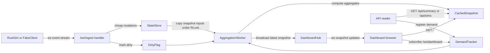

# Go Backend Runtime Architecture

## Purpose

This document describes how the Go backend operates at runtime after ingest was decoupled from dashboard aggregation.

It focuses on:

- data flow between sim clients, backend, API readers, and dashboard watchers
- computation performed on the ingest path versus the background aggregation path
- concurrency, locking, and goroutine structure
- expected workloads during demos and stress runs

This is a runtime architecture note, not a wire-format contract. For message schema details, see `docs/go-backend-v1-contract.md`.

## High-Level Model

The backend now has two intentionally separate responsibilities:

1. Accept and record simulation events as cheaply as possible.
2. Compute expensive aggregate dashboard views only when someone is actually watching.

That separation is the key architectural change.

Incoming sim traffic no longer triggers immediate aggregate recomputation. Instead, ingest updates in-memory state and marks the cached dashboard snapshot dirty. A separate background worker decides when to rebuild that snapshot.

## Main Participants

- Rust sim client: optional real simulation producer connected to `/ws/ingest`
- Fake load clients: Go-written traffic generators used in tests and demos
- Backend ingest handlers: one websocket handler per connected sim client
- Backend state store: in-memory authoritative state protected by `sync.RWMutex`
- Aggregation worker: one backend-owned goroutine that recomputes expensive dashboard snapshots
- Dashboard websocket clients: browsers connected to `/ws/dashboard`
- API readers: clients polling `/api/summary` or `/api/sims`

## End-To-End Flow

## Client Event Flow

Simulation clients send JSON event envelopes over `/ws/ingest`.

Typical startup sequence:

- `sim_hello`
- `sim_food_snapshot`
- then repeated `food_pickup`, `ant_turn_move`, `food_drop`

The fake-client runner mirrors that same pattern. Each fake client runs in its own goroutine, opens one websocket, sends the startup messages, then keeps sending one event per ticker interval.

In practical terms, startup has a burst profile because `sim_food_snapshot` can contain many food positions, and steady-state traffic becomes a high-volume stream of small event messages.

## Ingest Path

Each websocket connection to `/ws/ingest` gets its own request goroutine from the Go HTTP server.

For every received event, the backend does only this:

- decode the envelope and payload
- update the in-memory store
- mark the cached snapshot dirty

It does not:

- recompute dashboard aggregates
- walk all known loose food
- calculate nearest-neighbor metrics
- push synchronous dashboard updates

This keeps the ingest path bounded and predictable even when the dashboard math is expensive.

## Store Responsibilities

The state store is the authoritative in-memory model of live sims. It tracks:

- current sims keyed by `sim_id`
- per-sim metadata such as `ant_count`
- per-sim event counters such as pickups, drops, and turns
- current loose-food positions
- timing inputs used for `elapsed_seconds` and `events_per_second`

Writes take the store write lock and do cheap mutations only:

- `RecordHello`
- `RecordFoodSnapshot`
- `RecordDrop`
- `RecordPickup`
- `RecordTurnMove`

The store also exposes `DashboardSnapshotData()`, which copies the raw inputs needed for aggregate computation under `RLock` and returns them as a value. Heavy math runs after the lock is released.

## Cached Snapshot Flow

The backend keeps one cached dashboard snapshot in memory. That snapshot contains:

- `summary`
- `sims`

Readers do not recompute aggregates on demand. They receive the latest cached snapshot immediately.

This applies to:

- `/api/summary`
- `/api/sims`
- the initial `/ws/dashboard` message
- the initial HTML render for `/`

The result is eventual consistency rather than synchronous freshness.

## Demand-Driven Aggregation

Expensive recomputation happens only when there is demand.

Demand sources:

- at least one active `/ws/dashboard` subscriber
- or a recent `/api/summary` or `/api/sims` read within the API demand TTL

No-demand behavior:

- ingest still records new events
- dirty state is retained
- expensive aggregate recomputation does not run
- cached dashboard/API responses may remain stale until demand resumes

This means the backend can absorb incoming sim traffic without paying analytics cost when nobody is observing the system.

## Aggregation Worker

There is one aggregation worker goroutine for the whole backend process.

Its job is:

- wake when signaled and demand exists
- check whether recomputation is currently allowed
- copy snapshot inputs from the store
- compute derived metrics
- replace the cached snapshot
- broadcast the new snapshot to dashboard websocket clients

The worker coalesces multiple incoming dirty signals. If many ingest events arrive before the next recomputation window, the worker still performs only one refresh and uses the latest available store state.

## Adaptive Cadence

The worker is not event-driven in the sense of “compute after every message.” It is demand-driven and cadence-limited.

After a recomputation finishes, the backend schedules the next eligible recomputation using:

- `next_interval = clamp(250ms, last_compute_duration * 3, 5s)`

Implications:

- if aggregate computation is cheap, refreshes can happen frequently
- if aggregate computation is expensive, refreshes automatically back off
- the backend avoids piling expensive recomputations on top of each other

This is the main load-management mechanism for expensive analytics.

## Dashboard Flow

The browser dashboard works in two phases.

Phase 1:

- browser requests `GET /`
- backend serves HTML plus the latest cached summary values

Phase 2:

- browser opens `/ws/dashboard`
- backend sends the latest cached snapshot immediately
- backend registers the browser as an active watcher
- later worker refreshes are broadcast through the dashboard hub

The dashboard therefore sees:

- immediate cached state
- then eventual updates from the worker

The browser itself performs almost no computation. It simply renders snapshots pushed by the backend.

## API Flow

`/api/summary` and `/api/sims` serve cached data immediately.

They also count as demand. Repeated polling keeps the aggregation worker active, which means API consumers can drive snapshot freshness even without an open dashboard.

So the API has two roles:

- read the current cached view
- signal that fresh aggregate computation is worth doing

## Parallelism And Synchronization

The backend uses a deliberately small Go concurrency model:

- one goroutine per ingest websocket connection
- one goroutine for the aggregation worker
- one goroutine per dashboard websocket connection
- one `sync.RWMutex` inside the store
- one `sync.RWMutex` for cached snapshot access
- one `sync.Mutex` for demand and refresh scheduling state
- one `sync.Mutex` inside the dashboard hub for subscriber management

This gives a clear split:

- many concurrent I/O producers and consumers
- one shared mutable store
- one shared cached snapshot
- one serialized expensive aggregation pipeline

The design is intentionally not a worker pool. Aggregate computation is kept single-threaded on purpose so refresh work cannot multiply under load.

## Computational Hotspots

The most expensive derived metric is `meanNearestNeighborDistance`, which is quadratic in the number of loose-food positions.

Other nontrivial aggregate work includes:

- flattening all loose-food positions across sims
- counting occupied cells
- building sorted or copied per-sim summaries for output

These operations are acceptable in the background worker but were too expensive when previously triggered synchronously from ingest.

## Workload Types

The system now handles two very different workloads.

### Ingest workload

Characteristics:

- many websocket messages
- high frequency
- cheap per-event updates
- bursty startup due to food snapshots

Typical sources:

- real Rust sim instances
- `cmd/fakeclients` demo and stress runs

### Aggregation workload

Characteristics:

- CPU-heavy
- data-size dependent
- mostly driven by loose-food cardinality
- intentionally throttled by adaptive cadence

Typical triggers:

- an open dashboard in the browser
- API polling during demos or tests

## Why The New Architecture Matters

Before the refactor, every ingest event immediately recomputed dashboard state. Under heavy load, that meant the backend spent most of its time doing aggregate math instead of accepting new events.

Now the system behaves much better:

- sim traffic updates state quickly
- aggregate math is amortized and coalesced
- expensive work only happens when a consumer exists
- dashboard counts continue to rise under stress instead of freezing near the start

In short, throughput is protected by decoupling ingestion from observation.

## Demo And Stress Interpretation

For a live dashboard demo:

- startup food snapshots create an initial state burst
- event counters and loose-food metrics should keep changing while the load is running
- dashboard updates arrive in snapshots, not one per raw event

For a stress run:

- per-sim counts should continue climbing
- aggregate `events_per_second` should remain plausible
- stale reads are acceptable briefly, but long stalls under demand indicate trouble

## Current Limits

The current backend is intentionally simple and in-memory only.

Notable limitations:

- no durable persistence
- no replay or reordering
- no explicit per-sim sequence-gap tracking in production state
- no distributed aggregation
- no incremental nearest-neighbor algorithm yet

Those are future scalability topics. The current design is primarily about correct decoupling, clear concurrency, and reliable live demos under meaningful local load.
